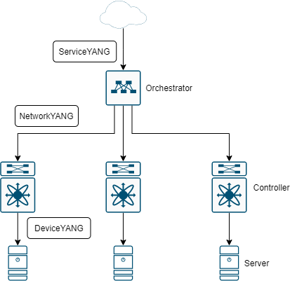
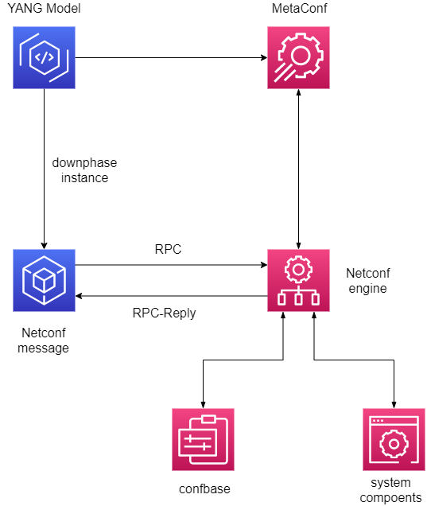

# [数据模型驱动的管理](Chapter.2.md)

P46-79(34)

2.1 2.2

略

2.3

客户端<--YANG作为合约，规范双向接口-->服务端  
客户端<--符合YANG的消息交换Netconf-->服务端

2.4

用语准确、适当地复用、保持最小惊讶设定、确保双方理解并紧扣主题

异构模型问题：  
* 建模是从CLI或内部数据库生成的，不同厂家有差异，跨供应商自动化是个问题
* 不能做到向后兼容就要求新建模块，但实际遵不遵守难说

SNMPv2 MIB ==> YANG（可行，但用途有限）

2.5

2.6

* 建模（模式）：YANG
* 编码（序列化）：XML/JSON/protobuf
* 协议（通信）：NETCONF/RESTCONF/gNMI
* 应用（编排）：NSO/YDK/OpenDaylight/Cloud-Opera
* 映射（实现）：Erlang/Python/C/C++/Java/Go

2.7 编码

* XML=XPath+XMLSchema+XSLT
* JSON（缺少Schema约束）
* protobuf紧凑二进制
* COBR简单二进制对象表示

2.8

2.9 协议

* NETCONF：引入ACID特性，事务三阶段（PREPARE、COMMIT、CONFIRM），hello消息提供能力清单
* RESTCONF：完全照搬REST机制，不支持事务机制，仅单机操作不支持跨网
* gNMI/gRPC：声明性配置+模型驱动
* CoAP：受限应用协议

2.10 编程语言

YDK、Ygot、Goyang、pyangbind

2.11 遥测

* OpenConfigFlow（protobuf）
* IETF Push（NETCONF）

2.12 

为NMS设计协议：简单、小巧、廉价……
三阶段事务：PREPARE、COMMIT、CONFIRM
