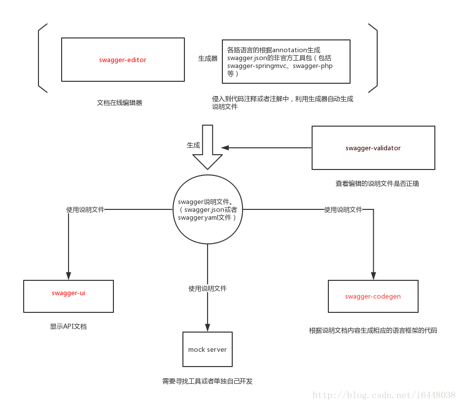
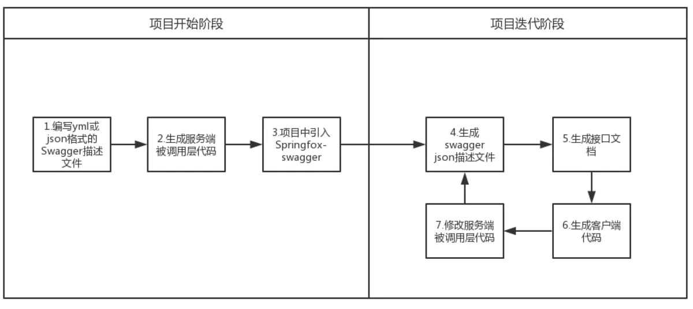
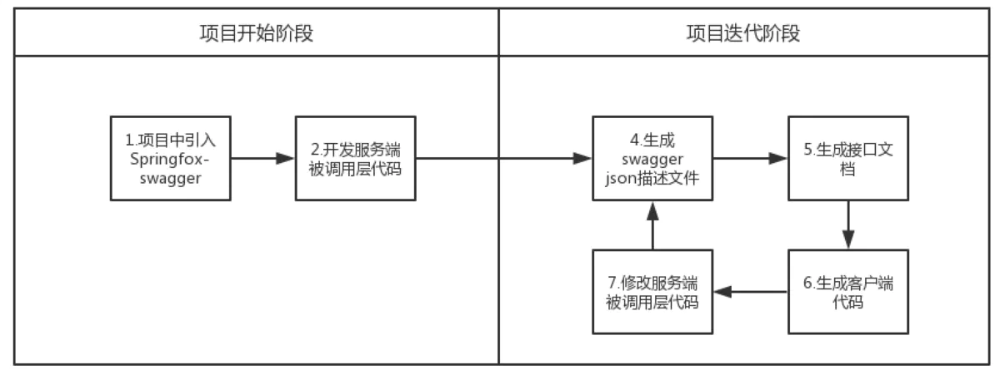

# 安装swagger套件

swagger是一套接口测试框架，针对接口开发的工作流程看图



简单来说就是前后端围绕接口编程，根据接口格式和模型，解耦业务功能实现和验证，开发周期如下图（借用了springfox的图请无视细节）

 

上图是项目启动先写接口文件，然后开搞，下图是直接在代码原型中加入注释通过工具生成接口文件，迭代过程是一样的

流程介绍完毕

swagger接口的规范为[OpenAPI](https://swagger.io/resources/open-api/)，它的[文档](https://github.com/OAI/OpenAPI-Specification)和目前[规范](https://github.com/OAI/OpenAPI-Specification/blob/main/versions/3.0.3.md)

目前除了swagger-hub外，主要使用swagger-editor、swagger-ui和swagger-codegen这三个工具

* [swagger-editor](https://github.com/swagger-api/swagger-editor)是一个接口文件编辑工具，通过它导入、预览和编辑接口文件，以制作接口文件
* [swagger-ui](https://github.com/swagger-api/swagger-ui)是一个接口文件测试工具，通过导入接口文件，验证接口功能
* [swagger-codegen](https://github.com/swagger-api/swagger-codegen)是一个接口文件生成框架的工具，输入一个接口文件，生成框架代码

各自git首页有详细安装和使用说明，下面挑一些简单的方法实现

安装的一些参考文档：[1](https://www.cnblogs.com/onelikeone/p/9997429.html)，[2](https://www.cnblogs.com/shamo89/p/7680941.html)，[3](https://testerhome.com/topics/8168)，[4](https://blog.csdn.net/ron03129596/article/details/53559803)

## swagger-editor

这里直接下载编译好的发布包  
运行编辑器需要默认有web服务器，这里选用了http-server

```shell
wget https://github.com/swagger-api/swagger-editor/archive/refs/tags/v3.18.2/swagger-editor.zip
unzip swagger-editor.zip

cd swagger-editor
npm install -g http-server
http-server -p 9200
```

直接在浏览器中访问`http://localhost:9200/`即可

## swagger-ui

swagger-ui也是需要一个web运行环境（应用+服务器），这里选用了express

```shell
# 1. 随便新建一个工程
npm init

# 2. 下载swagger-ui的编译版本，只保留dist目录到项目中
wget https://codeload.github.com/swagger-api/swagger-ui/zip/refs/tags/v3.52.5/swagger-ui-3.52.5.zip
unzip swagger-ui-3.52.5.zip
cd swagger-ui-3.52.5
mv dist ../

# 3. 编辑页面文件
vi swagger-ui.js

var express = require('express');
var app = express();
app.use('/swagger-ui', express.static('dist')); # /swagger-ui路径关联dist/目录
app.get('/', function (req, res) {
  res.send('redirect to /swagger-ui/index.html');
});
app.listen(3000, function () {
  console.log('Example app listening on port 3000!');
});

# 4. 运行swagger-ui
node swagger-ui.js
```

直接在浏览器中访问`http://localhost:3000/swagger-ui/index.html`即可  
接口文件的目录放在dist/之下，explore填写相对dist/的相对路径即可

另一种方法是使用docker，其中`BASE_URL`是WEB路径，`SWAGGER_JSON`是容器内接口文件路径，可以把接口文件的目录挂到容器的`/swaggerfiles`，方便随时修改

```shell
docker run --name swagger-ui -d -p 8080:8080 -e BASE_URL=/swagger -e SWAGGER_JSON=/swaggerfiles/swagger.json -v $DATADIR:/swaggerfiles swaggerapi/swagger-ui
```

## swagger-codegen

如果swagger-editor生成代码报错，那么可以使用codegen专门生成代码框架

可以下载安装，需要java1.8+

```shell
git clone https://github.com/swagger-api/swagger-codegen
cd swagger-codegen
mvn clean package
# or
./mvnw clean package
```

或者直接下载jar包，直接可用

```shell
wget https://repo1.maven.org/maven2/io/swagger/codegen/v3/swagger-codegen-cli/3.0.29/swagger-codegen-cli-3.0.29.jar -O swagger-codegen-cli.jar
```

使用时使用`generate`直接使用，指定接口文件、语言和输出路径即可

```shell
swagger-codegen generate -i https://petstore.swagger.io/v2/swagger.json -l ruby -o /tmp/test/
# or
java -jar swagger-codegen-cli.jar generate -i https://petstore.swagger.io/v2/swagger.json -l ruby -o /tmp/test/
```
