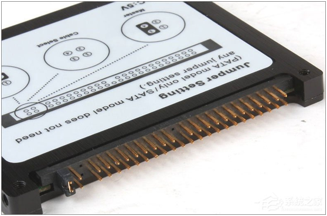
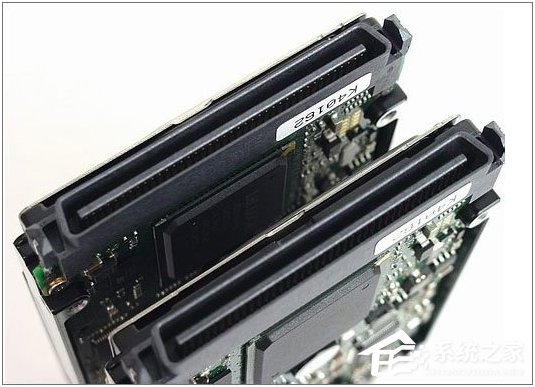
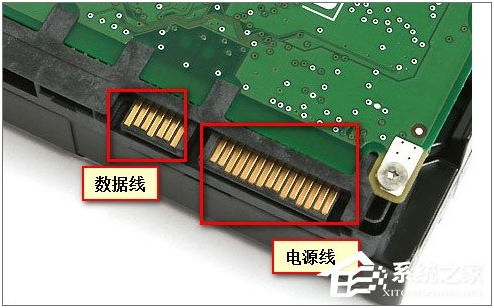
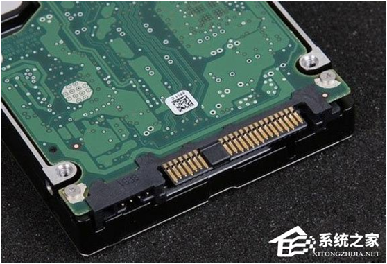
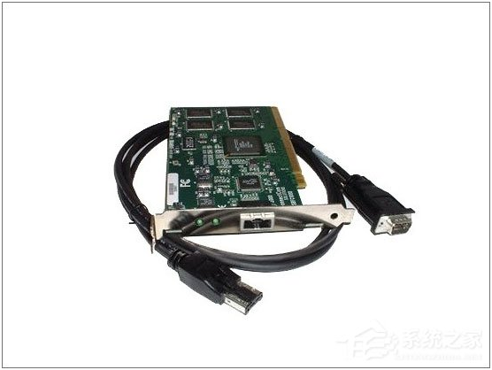

# 硬盘接口图示

**IDE**(Integrated Drive Electronics)，常见的2.5英寸IDE硬盘接口它的本意是指把“硬盘控制器”与“盘体”集成在一起的硬盘驱动器。IDE代表着硬盘的一种类型，但在实际的应用中，人们也习惯用IDE来称呼最早出现IDE类型硬盘ATA-1，这种类型的接口随着接口技术的发展已经被淘汰了，而其后发展分支出更多类型的硬盘接口，比如ATA、Ultra ATA、DMA、Ultra DMA等接口都属于IDE硬盘。其特点为：价格低廉，兼容性强，性价比高，数据传输慢，不支持热插拔等等。

**SCSI**(Small Computer System Interface)，SCSI并不是专门为硬盘设计的接口，是一种广泛应用于小型机上的高速数据传输技术。SCSI接口具有应用范围广、多任务、带宽大、CPU占用率低，以及热插拔等优点，但较高的价格使得它很难如IDE硬盘般普及，因此SCSI硬盘主要应用于中、高端服务器和高档工作站中。其特点为：传输速率高、读写性能好、可连接多个设备、可支持热插拔，但是价格相对来说比较贵。

**SATA**(Serial Advanced Technology Attachment)，使用SATA（Serial ATA）口的硬盘又叫串口硬盘，是未来PC机硬盘的趋势。Serial ATA采用串行连接方式，串行ATA总线使用嵌入式时钟信号，具备了更强的纠错能力，与以往相比其最大的区别在于能对传输指令（不仅仅是数据）进行检查，如果发现错误会自动矫正，这在很大程度上提高了数据传输的可靠性。串行接口还具有结构简单、支持热插拔的优点。

**SAS**(Serial Attached SCSI)，可以向下兼容SATA。具体来说，二者的兼容性主要体现在物理层和协议层的兼容。在物理层，SAS接口和SATA接口完全兼容，SATA硬盘可以直接使用在SAS的环境中，从接口标准上而言，SATA是SAS的一个子标准，因此SAS控制器可以直接操控SATA硬盘，但是SAS却不能直接使用在SATA的环境中，因为SATA控制器并不能对SAS硬盘进行控制；在协议层，SAS由3种类型协议组成，根据连接的不同设备使用相应的协议进行数据传输。其中串行SCSI协议（SSP）用于传输SCSI命令；SCSI管理协议（SMP）用于对连接设备的维护和管理；SATA通道协议（STP）用于SAS和SATA之间数据的传输。因此在这3种协议的配合下，SAS可以和SATA以及部分SCSI设备无缝结合。其传输速率比SATA要快很多。

**FC**(Fibre Channel)，其最初设计也不是为了硬盘设计开发的接口，是专门为网络系统设计的，但随着存储系统对速度的需求，才逐渐应用到硬盘系统中。光纤通道的主要特性有：热插拔性、高速带宽、远程连接、连接设备数量大等。
